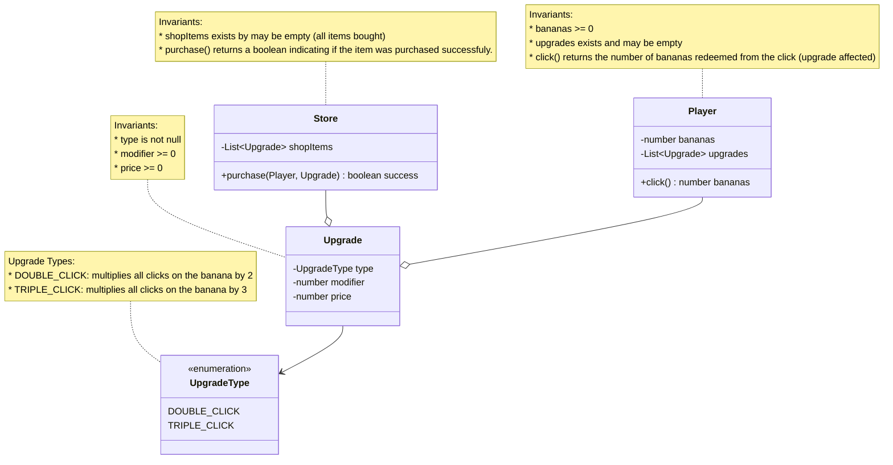

# Domain model

```mermaid
classDiagram

    class Player{
        -number bananas
        -List~Upgrade~ upgrades

        +click() number bananas
    }

    note for Player "Invariants:
    * bananas >= 0
    * upgrades exists and may be empty
    * click() returns the number of bananas redeemed from the click (upgrade affected)"

    class Store{
        -List~Upgrade~ shopItems
        +purchase(Player, Upgrade) boolean success
    }

    note for Store "Invariants:
    * shopItems exists by may be empty (all items bought)
    * purchase() returns a boolean indicating if the item was purchased successfuly.
    "

    class Upgrade {
        -UpgradeType type 
        -number modifier
        -number price
    }

    note for Upgrade "Invariants:
    * type is not null
    * modifier >= 0
    * price >= 0
    "

    class UpgradeType {
        <<enumeration>>
        DOUBLE_CLICK
        TRIPLE_CLICK
    }

    note for UpgradeType "Upgrade Types:
    * DOUBLE_CLICK: multiplies all clicks on the banana by 2
    * TRIPLE_CLICK: multiplies all clicks on the banana by 3
    "

    Upgrade --> UpgradeType
    Store --o Upgrade
    Player --o Upgrade
```
