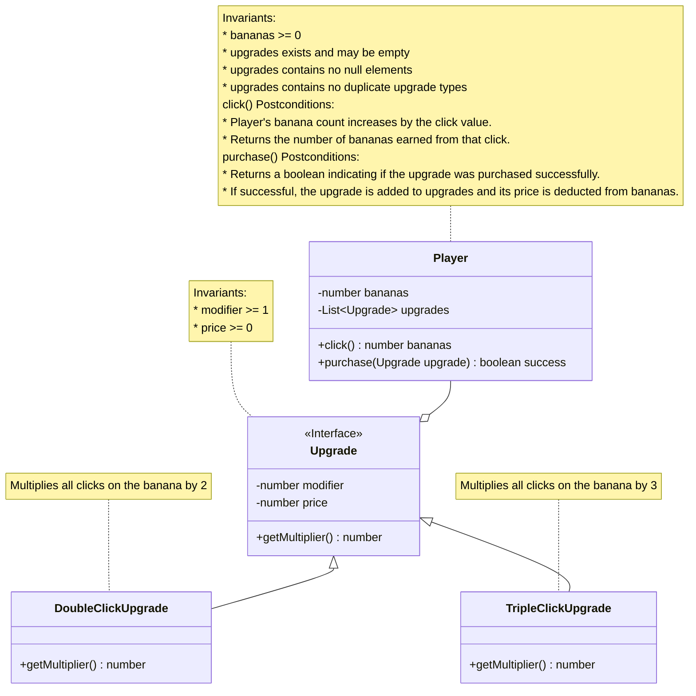

# Domain model

```mermaid
classDiagram
    class Player{
        -number bananas
        -List~Upgrade~ upgrades
        +click() number bananas
        +purchase(Upgrade upgrade) boolean success
    }
    note for Player "Invariants:
    * bananas >= 0
    * upgrades exists and may be empty
    * upgrades contains no null elements
    * upgrades contains no duplicate upgrade types
    click() Postconditions:
    * Player's banana count increases by the click value.
    * Returns the number of bananas earned from that click.
    purchase() Postconditions:
    * Returns a boolean indicating if the upgrade was purchased successfully.
    * If successful, the upgrade is added to upgrades and its price is deducted from bananas.
    "
    class Upgrade {
        <<Interface>>
        -number modifier
        -number price
        +getMultiplier() number
    }
    note for Upgrade "Invariants:
    * modifier >= 1
    * price >= 0
    "
    class DoubleClickUpgrade {
        +getMultiplier() number
    }
    note for DoubleClickUpgrade "Multiplies all clicks on the banana by 2"
    class TripleClickUpgrade {
        +getMultiplier() number
    }
    note for TripleClickUpgrade "Multiplies all clicks on the banana by 3"

    Upgrade <|-- DoubleClickUpgrade
    Upgrade <|-- TripleClickUpgrade
    Player --o Upgrade
```

# Changes made

* Removed store object (YAGNI)
* Changes upgrades to inherit the upgrade type instead of being an enum.

