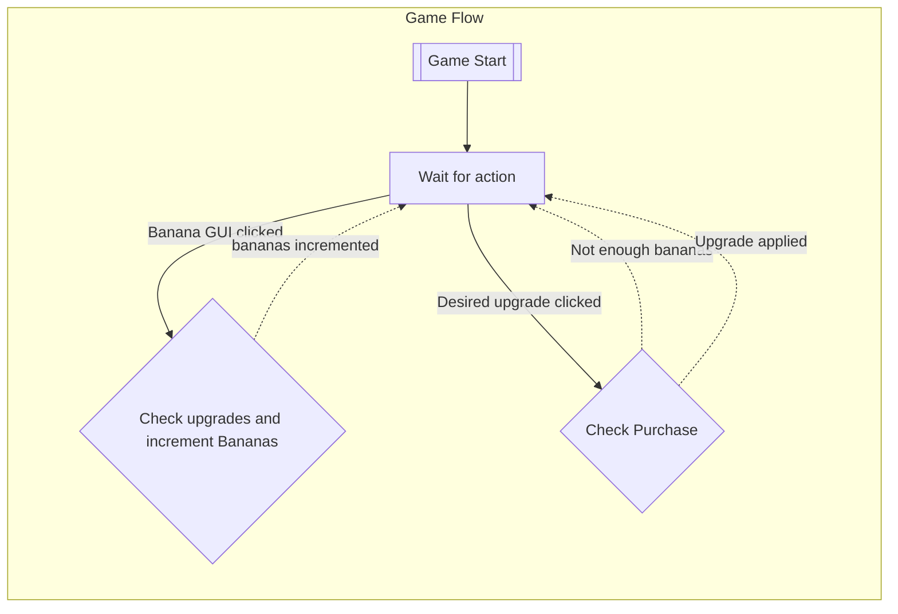

# Flows of interaction

## Sign in

This is the very first thing you'll see when you start my app.

```mermaid
flowchart 
    subgraph Game Flow 
        direction TB
        gameStart[[Game Start]]
        getAction[Wait for action]
        incrementBanana{Check upgrades and increment Bananas}
        purchaseU{Check Purchase}

        gameStart --> getAction

        %% Banana Logic
        getAction -- Banana GUI clicked --> incrementBanana
        incrementBanana -. bananas incremented .-> getAction

        %% Shop Logic
        getAction -- Desired upgrade clicked --> purchaseU
        purchaseU -. Not enough bananas .-> getAction
        purchaseU -. Upgrade applied .-> getAction
end
```
